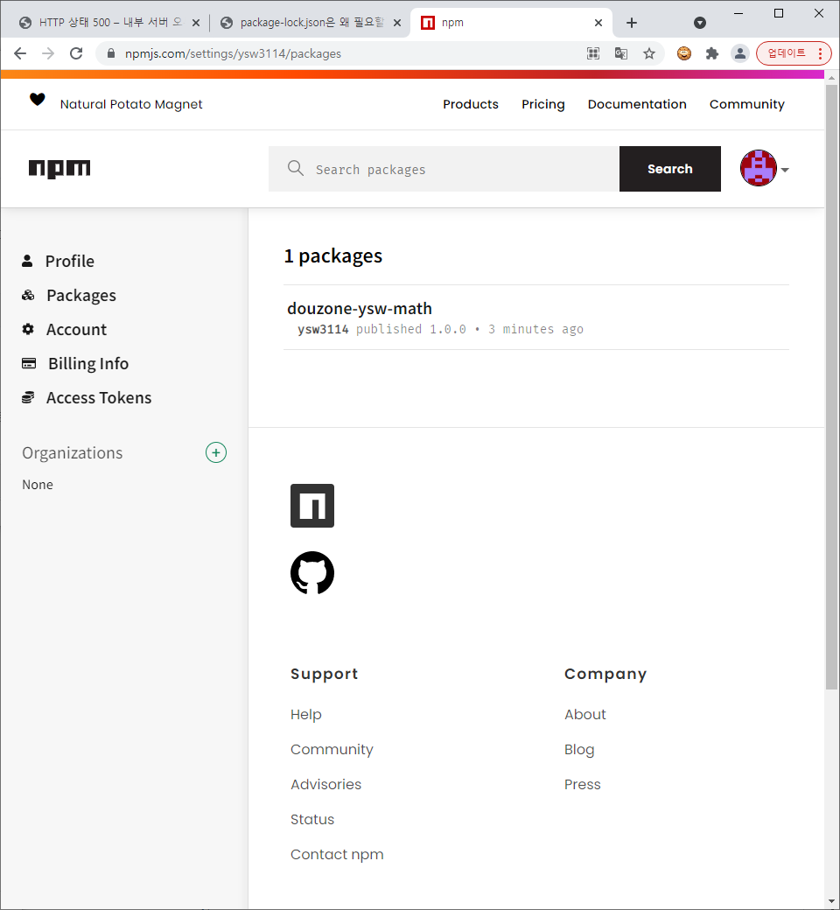

## node

> - Java 언어가 모든 OS 운영체제에서 Virtual Machine 환경 안에서 Runtime 이 구동 되듯이 Node.JS 는 웹브라우저에 종속적인 자바스크립트에서 외부에서 실행할 수 있는 Runtime 환경을 Chrome V8 엔진을 제공하여 여러 OS 환경에서 실행할 수 있는 환경을 제공
>
> ### 장점
>
> - 자바스크립트를 동일하게 사용해서 서버단 로직을 처리 가능
>   새로운 언어를 습득하지 않고도 자바스크립트를 활용해 서버기술을 개발/응용 가능
> - 개발이 빠르고 쉽다.
> - Non-blocking I/O와 단일 스레드 이벤트 루프를 통한 높은 처리 성능
> - 이벤트 기반 비동기방식이라 서버 무리가 적다.
> - java는 쓰레드에 의한 동기방식이라 요청이 오면 반드시 결과를 받은 후에 다음 로직이 처리
> - npm(node package manager)을 통한 다양한 모듈(패키지) 제공
>   npm을 이용해 자신이 필요한 라이브러리와 패키지를 검색해서 설치하고 사용할 수 있기 때문에 개발속도와 효율성이 크게 향상
>
> ### 단점
>
> - 이벤트 기반 비동기방식이라 서버단 로직이 복잡한 경우 콜백함수의 늪에 빠질 수 있다.
>   예를 들어, 한번의 요청에 대해 DB에서 조회한 결과값에 따라 다른 로직을 처리해야 하며, 이런 로직이 여러개인 경우 콜백함수 늪 (Callback Hell) 에 빠진다.
> - 코드를 순차적으로 실행하는 것이 아니라 비동기 방식으로 이벤트를 보내고, 응답(이벤트)이 오면 처리하는 방식이기 때문에 java 개발을 했던 방식으로 설계하고 프로그래밍하면 큰 문제가 발생한다. 
> - 단일 쓰레드(Single Thread)이기 때문에 하나의 작업 자체가 많이 걸리는 웹서비스에는 어울리지 않다. 
>   게시판형태와 같이 가벼운 I/O가 많은 웹서비스에 어울린다. 
> - 코드가 수행되어야 코드에 에러가 있는지 알 수 있으며, 에러가 날 경우 프로세스가 내려가기 때문에 테스트가 엄청 중요하다. 반드시 모든 케이스에 대해 소스코드를 검증해야 한다.
>
> ### Node.js 가 어울리는 웹서비스
>
> - 간단한 로직. 
> - 대용량(동시에 여러 request를 처리)
> - 빠른 응답시간 요구
> - 빠른 개발 요구
> - 비동기방식에 어울리는 서비스(네트워크 스트리밍 서비스, 채팅 서비스 등)
>
> ##  Node.js 가 어울리지 않는 웹서비스
>
> - 단일 처리가 오래 걸리는 경우 : 싱글 쓰레드이기 때문
> - 서버 체크로직이 많은 경우 : 비동기방식이기 때문에 CallBack Hell에 빠지지 않기 위해
> - 업무 복잡도/난이도가 높은 경우 : 에러가 나면 서버가 죽기 때문에 코드 품질 중요

## NPM

> -  자바스크립트 프로그래밍 언어를 위한 패키지 관리자

## yran

> - 자바스크립트 패키지 매니저 중 하나


node수업 정리.txt

```
1. 패키지(package)
    - 완전한 애플리케이션 ex) devtools(nodedaemon, babel, webpack)
    - 프로젝트에서 사용하는 모듈(라이브러리)
2. 의존성(dependency)
    - 개발하고 있는 프로젝트(애플리케이션, 패키지)에서 설치하고 사용하는 다른 패키지
    - 일반 의존성
      개발하고 있는 프로젝트에서 사용하는 패키지로 꼭 배포에 꼭 포함
      $ npm i ...
    - 개발 의존성
      개발에 필요하거나 도움이 된느 패키지(dev tools) 배포에 포함되지 않는다.
      $ npm i -D    ex) npm i -D nodaemon
3. 패키지 설치 방식
    1) 전역(global) 설치: 여러 프로젝트에서 공통으로 사용하는 도구 설치
        $ npm i -g  
    2) 지역(project local) 설치: 특정 프로젝트에만 종속적인 도구나 라이브러리들
       $ npm i
       $ npm i -D  
    3) 패키지 설치
       [project-ex01] $ npm i ejs               (local install, general dependency)
       [project-ex01] $ npm i -D nodedaemon     (local install, development dependency)
       [project-ex01] $ npm i -g gulp           (global install)
    4) 패키지 삭제
       [project-ex01] $ npm un ejs              (local install 삭제)
       [project-ex01] $ npm un -g gulp          (global instakk 삭제)

4. Node(JavaScript) Project(C/S Application, Package) 생성
    1) 프로젝트 디렉토리 생성   (mkdir)
    2) 프로젝트 이동            (cd)
    3) [project-ex01] $ npm init -y (프로젝트 매니페스트 파일(package.json) 생성, 프로젝트 초기화) -> package.json 생성됨
    `package-lock.json` 파일은 의존성 트리에 대한 정보를 가지고 있으며 `package-lock.json` 파일이 작성된 시점의 의존성 트리가 다시 생성될 수 있도록 보장합니다. /자식의 의존성을 최신으로 하지못하는 문제가 있어서 lock.json에서 해결
    
    

5. Module
    1) 코어 모듈(fs, os, ..... node 에서 제공해주는 모듈)
    	filesystem(fs), outputstream(os), .... node에서 제공해주는 모듈
    2) 파일 모듈: 파일 경로로 불러와서 모듈안의 객체, 함수, 클래스를 사용한다.
    	파일 경로로 불러와서 모듈안의 객체, 함수, 클래스를 사용한다.
    3) npm 모듈: npm를 통해서 node_module에서 설치해서 사용하는 모듈
        - 로컬 배포
        - 원격 배포  
        npm을 통해서 node_module에서 설치해서 사용하는 모듈

6. npmjs.com npm registry에 패키지 배포
    1. 사용자 등록
    2. 배포
        $npm adduser
        Username: ...
        Password: ...
        [douzone-ysw-math] $ npm publish

7. helloweb-ex01: 맨바닥에서 웹애플리케이션 만들어 보기
    1. app01: based on http: core module
    2. app02: based on http, fs: core module
    3. app03: based on connect, serve-static: npm package
        설치할것
        $npm i connect
        $npm i serve-static 
    4. app04: based on connect, serve-static, connect-route: npm package
        $npm i connect
        $npm i serve-static 
        $npm i connect-route


8. helloweb-ex02: express 프레임워크 기반의 웹애플리케이션 만들기
[helloweb-ex02] $npm i express
[helloweb-ex02] $npm i ejs
[helloweb-ex02] $npm i -D nodaemon
```


### npx란?

npm을 좀 더 편하게 사용하기 위해서 npm에서 제공해주는 하나의 도구입니다.

npm 레지스트리의 패키지 사용 경험을 파악하기 위한 도구, 지금까지 일반적인 npm과 관련하여 약간의 귀찮은 과정들이 필요했던 여러 가지 사항을 크게 단순화합니다.

npm = Package Manager(관리)

npx= Package Runner(실행)


> ### Create React App
>
> [Create React App](https://github.com/facebookincubator/create-react-app)은 **React 배우기**에 간편한 환경입니다. 그리고 시작하기에 최고의 방법은 **새로운 [싱글 페이지 애플리케이션](https://ko.reactjs.org/docs/glossary.html#single-page-application)** 입니다.
>
> 이것은 개발 환경을 설정하고, 최신 JavaScript를 사용하게 해주며, 좋은 개발 경험과 프로덕션 앱 최적화를 해줍니다. [Node 14.0.0 혹은 상위 버전 및 npm 5.6 혹은 상위 버전](https://nodejs.org/en/)이 필요합니다. 새로운 프로젝트를 만들기 위해 아래의 명령어를 실행합니다.


> ### npm module 사용 예시
>
> 
>
> ``` javascript
> // douzone-soottoppi-math/douzone-soottoppi-math.js
> 
> module.exports = {
>     // 함수 생성법
>     sum: function () {
>         var sum = 0;
>         Array.from(arguments).forEach(function (e) {
>             sum += e;
>         });
> 
>         return sum;
>     },
> 
>     max: function () {
>         var max = Number.MIN_SAFE_INTEGER;
>         Array.from(arguments).forEach(function (e) {
>             max = e > max ? e : max;
>         });
> 
>         return max;
>     },
> 
>     min: function () {
>         var min = Number.MAX_SAFE_INTEGER;
>         Array.from(arguments).forEach(function (e) {
>             min = e < min ? e : min;
>         });
> 
>         return min;
>     },
> };
> 
> ```
>
> 위와 같이 파일 생성 후 해당 폴더안의 package.json을 열어서 어떤 파일을 실행할 것인지 설정을 해줘야한다
>
> package.json의 main 부분에 실행할 파일명(여기선 douzone-soottoppi-math.js)을 지정해준다
>
> 
>
> 그리고 실제로 사용할 프로젝트에서(practice-ex02)에서 다음 명령어를 통해 모듈을 사용할 수 있게끔 한다
>
> ```
> $ npm i ../douzone-soottoppi-math
> ```
>
> douzone-soottoppi-math 폴더를 모듈로 설치하겠다는 뜻이다
>
> 여기서 어떤 파일을 모듈파일로 지정했는지를 위에서 설정했다
>
> 
>
> ```javascript
> // project-ex02/app-ex02.js
> var dzMath = require("douzone-soottoppi-math");
> 
> // 파일 모듈을 사용하고 싶다면 다음과 같이 파일의 경로를 지정해주면 된다
> // var dzMath = require("../douzone-soottoppi-math/douzone-soottoppi-math");
> 
> 
> console.log(dzMath.sum(10, 20, 30, 40, 50));
> console.log(dzMath.max(10, 20, 30, 40, 50));
> console.log(dzMath.min(10, 20, 30, 40, 50));
> 
> ```
>
> 조금 전 project-ex02에서 douzone-soottoppi-math 모듈을 설치했었다
>
> douzone.soottoppi-math.js 모듈 파일을 사용하기 위해 require 함수를 통해 모듈을 가져온다
>
> 그러면 그안의 함수들(sum, max, min)을 사용할 수 있다


> ### 패키지 배포
>
> npmjs.com npm registry에 자신의 패키지를 배포할 수 있다
>
> 
>
> 배포하고 싶은 패키지 디렉토리로 이동한다
>
> 터미널에서 다음 명령어를 입력한다
>
> ``` 
> $ npm adduser
> ```
>
> 입력 메시지가 뜨면 npmjs의 id, password, email을 입력하여 로그인한다
>
> 로그인이 성공하면 배포 준비가 끝났으니 배포하자
>
> ```
> $ npm publish
> ```
>
> 성공되었다면 www.npmjs.com/[패키지이름]을 통해 접근이 가능하다
>
> 
>
> 나의 계정에 저장된걸 볼수있다. 
>
> 
>
> 배포가 된 패키지를 설치하기 위해서는 설치하고자 하는 프로젝트 디렉토리 경로에서 다음 명령어를 입력한다
>
> ```
> $ npm i [패키지이름]
> ```
>
> 여기서는 npm i douzone-soottoppi-math를 입력하면 현재 프로젝트에 패키지를 설치해준다


> ### exports vs moule.exports
>
> **require() 함수는 return 값으로 module.exports를 반환한다**
>
> module.exports는 빈 객체를 의미한다 ( ==> { } )
>
> exports는 module.exports인 { }를 가리킨다 module.exports에 대한 alias라고 봐도 똑같다
>
> exports와 module.exports를 같이 쓰게되면 문법적으로 오류는 없으나 사용에 주의하여야한다
>
> 둘은 결국 처음에는 빈 객체라는 같은 값을 참조하였으나 
>
> **module.require를 수정하게 되면 빈 객체에서 다른 값을 가리키게 되는데 exports는 여전히 빈 객체를 가리킨다(refer)**
>
> **처음에 require 함수는 module.exports를 반환한다고 하였으므로 exports가 가리키는 값들은 무시되고 module.exports의 객체만 반환된다**


## ES6문법이란?

ECMAScript 2015로도 알려져 있는 ECMAScript 6는 ECMAScript 표준의 가장 최신 버전입니다.


#### ES6의 새로운 기능

- const and let
- Arrow functions(화살표 함수)
- Template Literals(템플릿 리터럴)
- Default parameters(기본 매개 변수)
- Array and object destructing(배열 및 객체 비구조화)
- Import and export(가져오기 및 내보내기)
- Promises(프로미스)
- Rest parameter and Spread operator(나머지 매개 변수 및 확산 연산자)
- Classes(클래스)


**let /const**

: `let`과  `const`와 동일하게 모두 블럭 범위(변수는 범위 내에서만 사용할 수 있다.)


`const`는 var보다 강력하고 일단 사용되면 **변수를 다시 할당할 수 없습니다.**

```js
try{
    if(true){
        const NUM = 10;
    }

    console.log(NUM);
}catch(e){
    console.error("error: " + e);
}
```

result

```result
error: ReferenceError: NUM is not defined
```


`let`은 새로운 값을 가질 수도 있고 재할당이 가능함

```js
try{
    if(true){
        var i = 10;
        let j = 20;
    }

    console.log(i,j);
}catch(e){
    console.log('error: ' + e);
}
```

result

```result
10
error: ReferenceError: j is not defined
```


**Template Literal**

: 백틱(`)을 사용하여 문자열 내에서 변수 사용가능하다.

```js
let no = 10;
let name = '둘리';
let email = 'dooly@gmail.com';

console.log(`no:${no}, name:${name}, email:${email}`);
```

result

```result
no:10, name:둘리, email:dooly@gmail.com
```


**Default parameters(기본 매개 변수)**

: 값이 없거나 `undefined`가 전달될 경우 이름붙은 매개변수를 기본값으로 초기화할 수 있다.

```js
const print = function(strs, end='\n') {
    console.log(strs.join(end));
 }

 print(['Always', 'with', 'me']);
```

result

```result
Always
with
me
```

- 기본 매개변수를 사용하여 (end='\n')  print() 메소드에서 매개변수할당을 잊어버렸어도 **해당 값(end='\n')**이 사용되는걸 확인할 수 있다.


**Arrow Functions(화살표 함수)**

: function 키워드 대신 화살표(=>)를 사용하여 보다 간략한 방법으로 함수를 선언할 수 있다

```js
console.log("\n---ex1----------------------------------\n");
let numbers = [1, 2, 3, 4, 5];

numbers.forEach(function(n){

    let result = (x => x* x)(n);


    process.stdout.write(`${n}:${power(n)}\t`);
});
```

result

```result
---ex1----------------------------------

1:1     2:4     3:9     4:16    5:25
```


//구조분해할당 - 11/17에 추가된 내용

#### **구조분해할당(Destructuring assignment)**

:  MDN 정의에 따르면 배열이나 객체의 속성을 해체하여 그 값을 개별 변수에 담을 수 있게 하는 JavaScript 표현식

- ##### 객체 분해 할당

ex1

```js
const user = {
    firstName: '둘',
    lastName: '리',
    email: 'kickscar@gmail.com'
};

let {firstName, lastName} = user;
console.log(firstName, lastName);
```

- 객체는 변수명과 동일한 프로퍼티 키를 찾아서 그 키에 대응하는 값을 변수에 할당


ex2

```js
const goods = {
    name: 'TV',
    price: 10000,
    stockCount: 30
};

let {name, price, countStock=0, stockCount=0} = goods;
console.log(name, price, countStock, stockCount);
```

- 기본값 설정, 프로퍼티가 없는 경우를 대비할 수 있다.


ex3

```js
const person = {
    name: '안대혁',
    country: 'korea'
}; 

const {name: fullName, country: place} = person;
console.log(fullName, place);
```

- 키와 다른 변수명을 가지는 변수에 분해 할당하기


ex4

```js
const student = {
    name: '둘리',
    age: 10,
    score: {
        math: 90,
        korean: 70,
        science: 100
    }
};

const {
    name: studentName,
    score:{
        math=0, 
        korean=0, 
        science=0, 
        music=0
    }
} = student;
console.log(`${studentName}의 성적
수학: ${math}
국어: ${korean}
과학: ${science}
음악: ${music}`);
```

- student 내부의 프로퍼티들을 각각 프로퍼티 명과 이름이 동일한 변수에 값들을 분해 할당해준다.


ex5

```js
const averageScore = function({name: studentName, score:{math=0, korean=0, science=0}}) {
    console.log(`${studentName}의 평균은 ${(math + korean + science) / 3} 입니다.`);
};

averageScore(student);
```

- 함수에 파라미터 값으로 대입해서 분해 할당이 가능하다.


- ##### 배열 분해 할당

  - 다음에 한데용


### class

class는 객체 지향 프로그래밍(OOP)의 핵심, 코드를 안전하게 캡슐화


예제

```js
class Rect{
    constructor(w, h) {
        this.w = w;
        this.h = h;
    }

    draw() {
        console.log(`Rect(w=${this.w}, h=${this.h})를 그렸습니다.`);
    } 
}

// test
const rect1 = new Rect(10, 20);
const rect2 = new Rect(100, 200);

rect1.draw();
rect2.draw();
```

- constructor는 클래스 인스턴스를 생성하고 생성한 인스턴스를 초기화하는 역할을 합니다. **new Rect()** 코드를 실행하면 **People.prototype.constructor**가 호출됩니다.


### 생성자 함수(prototype 기반)

```js
const Circle = function(x, y, r) {
    this.x = x;
    this.y = y;
    this.r = r;
}

Circle.prototype.draw = function() {
    console.log(`Circle(x=${this.x}, y=${this.y}, r=${this.r})를 그렸습니다.`);
}

const circle1 = new Circle(10, 20, 5);
const circle2 = new Circle(100, 200, 5);

circle1.draw();
circle2.draw();
```


- 프로토타입은 es6이전에 클래스 개념이 없었을때 Class형태를 구현하려면 prototype을 이용해 구현해야 했습니다.


### extends

```js
class Shape {
    constructor(bgColor, lnColor) {
        this.bgColor = bgColor;
        this.lnColor = lnColor;
    }

    draw() {
        console.log('그릴 수 없습니다.');
    }
    
    area() {
        console.log('구할 수 없습니다.');
    }
}

class Triangle extends Shape {
    constructor(w, h) {
        super('red', 'black');
        this.w = w;
        this.h = h;
    }

    // @Override
    draw() {
        console.log(`Triangle(w=${this.w},h=${this.h},bgColor=${this.bgColor},lnColor=${this.lnColor})를 그렸습니다.`)
    }
}

const tri1 = new Triangle(10, 20);

tri1.draw();
tri1.area();
```


- extends 키워드를 통하여 클래스를 상속 받아, 자식 클래스를 만들 수 있습니다.


### MJS

Node.js 애플리케이션과 함께 사용할 ES 모듈 (ECMAScript 모듈)을 포함하는 소스 코드 파일입니다.


### export&import

모듈 스코프에서 정의된 이름을 export 구문을 통해 다른 파일에서 사용할 수 있습니다.

그후, export된 이름을 다른 파일에서 import 구문을 통해 가져온 뒤 사용할 수 있습니다.


### Default exports

:default로 선언된 모듈은 하나의 파일에서 단 하나의 변수 또는 클래스 등만 export할 수 있습니다.

ex08.01.mjs

```mjs
 export default function(a, b) {
    return a + b;
}

// 오류:  이름 없이 export하기 때문에 하나만 export 할 수 있다.
// export default function(a, b) {
//     return a - b;
// }
```

- 모듈 당 딱 한개의 default export만 있어야 함. default export로 객체, 함수 클래스 등이 될 수 있다.


ex08.02.mjs

```mjs
 export default {
    add: function(a, b) {
        return a + b;
    },
    substract: function(a, b) {
        return a - b;
    }
}
```

- 이름 없는 객체를 하나 export 하는 경우


### named export

: 한 파일 내에서 여러 변수/클래스 등을 export하는것이 가능하다.

ex08.03.mjs

```mjs
export const add = function(a, b) {
    return a + b;
};

export const subtract = function(a, b) {
    return a - b;
}
```

- 선언과 동시에 export하는 예제이다. 이름을 선언하는 구문 앞에 export를 붙여주면 된다.


ex08.04.mjs

```,js
const add = function(a, b) {
    return a + b;
};

const subtract = function(a, b) {
    return a - b;
}

export {add, subtract};
```

- const로 선언후 export{add, subract}를 통해 export 해준다.


**한파일에 named export & unamed export 같이 선언해주는 예제**

ex08.05.mjs

```mjs
const add = function(a, b) {
    return a + b;
};

const subtract = function(a, b) {
    return a - b;
}

export {add, subtract};
export default {add, subtract};
```


**ex08.01~ ex08.05에서 export 한것을 import하여 사용하는 예제**

```mjs
// 1.
// unnamed export 모듈에서 대상을 하나 import 할 때는 이름을 지정해야 한다.

import myFunction from './ex08.01.mjs';
import myObject from './ex08.02.mjs';


console.log(myFunction(10, 20));
console.log(myObject.add(10, 20));


// 2.
// named export는 import 대상이 다수가 될 수 있기 때문에 하나의 특정 이름으로 받을 수 없다.
// 대신 * as ~ 를 사용한다.
//
// import m from './ex08.03.mjs'
import * as m from './ex08.03.mjs'

console.log(m.add(10, 20));
console.log(m.subtract(10, 20));

// 3.
import {subtract} from './ex08.04.mjs';
console.log(subtract(20, 10));


// 4.
import math, {add} from './ex08.05.mjs';
console.log(math.subtract(20, 10), add(10, 20));

```


#### 웹 애플리케이션 만들어보기

- **app01.js**

: based on http: core module

```js
const http = require('http'); //http모듈을 가져온다.

const port = 8080; //포트 번호
//Creating http Server
const server = http.createServer(function(req, resp){ 
    resp.writeHead(200,{ 
    //response.writeHead()은 요청에 응답 헤더를 보내는 ‘http’ 모듈의 내장 속성이다.
        'Content-Type': 'text/html'  //내용 타입
    });

    //body 내용
    resp.end('<h1>Hello World</h1>');

});

server.listen(port,function(){
    console.log(`http server running on ${port}`);
})
```


- **app02.js**

: based on http, fs: core module

```js
const http = require('http'); //http모듈을 가져온다.
const fs = require('fs'); //File System 모듈 //기초로 파일 읽기와 쓰기 기능이 있다.


const port = 8080;
const server = http.createServer(function(req, resp){ 
    console.log(req.url);
    if(req.url === '/'){
        req.url = '/index.html'; //url을 설정
    }

    //fs.readFile(path[,option], callback)
    fs.readFile(`${__dirname}/public${req.url}`, function(error, data){
        //__dirname은 현재 실행중인 폴더 경로 
        // /helloweb-ex01/public/index.html의 파일을 읽는다.
        resp.writeHead(200,{ 
        //response.writeHead()은 요청에 응답 헤더를 보내는 ‘http’ 모듈의 내장 속성이다.
            'Content-Type': 'text/html' //내용 타입
        });
        resp.end(data);
    });
});

server.listen(port,function(){
    console.log(`http server running on ${port}`);
})
```

/public/index.html

```html
<!DOCTYPE html>
<html lang="ko">
<head>
    <meta charset="UTF-8">
    <meta http-equiv="X-UA-Compatible" content="IE=edge">
    <meta name="viewport" content="width=device-width, initial-scale=1.0">
    <title>Document</title>
</head>
<body>
    <h1>Hello World</h1>
</body>
</html>
```


- **app03.js**

    based on connect, serve-static: npm package
        설치할것
        $npm i connect
        $npm i serve-static 

```js
const connect = require('connect'); //connect 모듈 추출 // npm i connect
const serveStatic = require('serve-static'); //npm i serve-static

const port = 8080;
const app = connect();
//public디렉토리에 포함된 이미지, CSS 파일 및 JavaScript 파일을 제공?로드?
app.use(serveStatic(__dirname + "/public")); 
//helloweb-ex01/public
app.listen(port, function(){
    console.log(`http server running on ${port}`);
});
```


- **app04.js**

```
  based on connect, serve-static, connect-route: npm package
        $npm i connect
        $npm i serve-static 
        $npm i connect-route
```


```js
const connect = require('connect');
// npm i connect
const serveStatic = require('serve-static');
//npm i serve-static
const connectRoute = require('connect-route');
// npm i connect-route

const port = 8080;
const app = connect();

// 추가적인 url확장이 가능하다.
app.use(connectRoute(function(router) {
    //GET - /
    router.get("/", function(req, resp) {
        resp.writeHead(200, {
            'Content-Type': 'text/html'
        });
        resp.end('<h1>Main</h1>');
    });
    //GET - http://localhost:8080/user?no=3
    router.get("/user", function(req, resp){
        console.log(req._parsedUrl.query);

        req.query = {};
        params = (req._parsedUrl.query || '').split('&');
        params.forEach(function(param){
            tokens = param.split('=');
            req.query[tokens[0]] = tokens[1];
        });

        resp.writeHead(200, {
            'Content-Type': 'text/html'
        });
        resp.end(`<h1>User No: ${req.query.no}</h1>`);   
        //User No: 3 으로 출력된다.     
    });

    //GET - http://localhost:8080/guestbook
    router.get("/guestbook", function(req, resp){
        resp.writeHead(200, {
            'Content-Type': 'text/html'
        });
        resp.end('<h1>Guestbook List</h1>');
    });
    
    //GET - http://localhost:8080/board
    router.get("/board", function(req, resp){
        resp.writeHead(200, {
            'Content-Type': 'text/html'
        });
        resp.end('<h1>Board List</h1>');
    });    

    //GET - http://localhost:8080/board/3
    router.get("/board/:no", function(req, resp){
        resp.writeHead(200, {
            'Content-Type': 'text/html'
        });
        resp.end(`<h1>Board View: ${req.params.no}</h1>`);
        //Board View:3
    });    

}));
app.use(serveStatic(__dirname + "/public"));
//특정 경로에 있는 폴더(public 폴더)를 요청에 의해서 
//바로 파일을 가져올 수 있는 기능을 제공 해주는 모듈 "serve-static"
//helloweb-ex01/public

app.listen(port, function(){
    console.log(`http server running on ${port}`);
});
```

